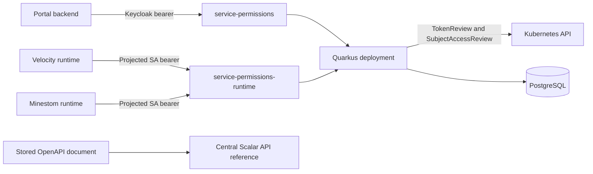

# Permissions REST Hardcut Design

**Date:** 2026-07-25

**Status:** Approved design

**Primary repository:** `groundsgg/service-permissions`

## Summary

Grounds will replace the remaining `service-permissions` gRPC runtime API with a REST-only API. The change is an intentional hardcut: the service, runtime plugin, charts, Forge support, bundle, and deployed workloads form one incompatible release unit. No gRPC compatibility layer or dual-stack transition will remain.

The service will expose one code-first OpenAPI contract covering administration, runtime, and environment-sync endpoints. The exact wire reference will be published to the central Scalar API reference. Explanatory integration and operations documentation will live in `groundsgg/docs`.

Runtime workloads will authenticate with short-lived projected Kubernetes ServiceAccount tokens dedicated to the `service-permissions` audience. `service-permissions` will validate them with TokenReview and delegate authorization to Kubernetes with SubjectAccessReview against the actual REST paths. Portal administration continues to use Keycloak bearer tokens and the existing application-level permission checks.

Internal HTTPS is a platform-wide concern and is deliberately deferred to [groundsgg/grounds-pulumi#298](https://github.com/groundsgg/grounds-pulumi/issues/298). The initial REST hardcut therefore uses cluster-internal HTTP. This exception is acceptable for the initial rollout because Grounds currently has no production systems or users, but it remains explicit technical debt.

## Goals

- Remove gRPC and Protobuf from the permissions service and its runtime consumers.
- Provide a documented, versioned REST contract for every `service-permissions` API.
- Close the unauthenticated runtime snapshot and catalog-registration paths.
- Preserve the existing permission-evaluation and local-snapshot behavior.
- Make runtime access declarative in Forge and the platform bundle.
- Keep runtime authorization least-privileged down to allowed catalog sources.
- Make the hardcut testable, observable, and jointly reversible.
- Document the developer flow, runtime guarantees, authentication model, and troubleshooting path.

## Non-goals

- Maintaining a gRPC compatibility endpoint or dual-stack deployment.
- Replacing the existing policy engine or permission data model.
- Replacing local runtime snapshot evaluation with per-check network calls.
- Replacing snapshot polling with server-pushed refresh messages.
- Generating the first Java/Kotlin client from OpenAPI.
- Introducing a service mesh, mTLS, or service-specific certificate system in this migration.
- Redesigning the Portal administration UI.
- Generalizing every existing Grounds service to REST in the same change.

## Current State

`service-permissions` currently has a REST administration API and three gRPC runtime operations:

- `GetPlayerSnapshot`
- `RegisterPermissionManifest`
- `RefreshOnlinePlayers`

Velocity and Minestom clients in `plugin-permissions` use generated Protobuf types and blocking gRPC stubs. Connections use plaintext. The runtime gRPC endpoints do not use the Portal's Keycloak and `AdminAuthorizationService` model, which leaves catalog registration without a suitable workload trust boundary.

The runtime already evaluates permissions locally from snapshots. Snapshots contain refresh and expiry timestamps, and the clients retain a still-valid cached snapshot during temporary service failures. `RefreshOnlinePlayers` does not carry authoritative state and has no required consumers.

## Architecture

One Quarkus deployment exposes two logical API surfaces through two Kubernetes Services:

- `service-permissions` is the administration and Portal-facing Service.
- `service-permissions-runtime` is an internal `ClusterIP` Service for Minecraft runtimes.

Both Services target the same pods and HTTP listener. The additional Service creates a stable runtime URL, separates deployment configuration, supports targeted NetworkPolicies, and establishes the DNS identity needed by the later HTTPS work. It is not a separate application and does not replace backend authorization.

The public ingress must not publish `/v1/permissions/runtime/**`. Backend authentication remains authoritative even if routing is misconfigured.



## API Organization

The service publishes one OpenAPI document with these tags:

- `Administration`
- `Runtime`
- `Environment sync`

The API uses JSON, camel-case property names, ISO-8601 timestamps, and string enum values. All error responses use RFC 9457 `application/problem+json`.

The OpenAPI document declares two bearer security schemes:

- `portalBearer` for Keycloak access tokens
- `workloadBearer` for projected Kubernetes ServiceAccount tokens

There is no locally hosted Swagger UI or Scalar renderer. The deterministic stored specification is published to `groundsgg/api-reference`, which provides the central Scalar UI.

## Runtime Snapshot API

### Request

```http
GET /v1/permissions/runtime/players/{playerId}/snapshot?serverType=lobby&serverId=lobby-1
Authorization: Bearer <projected-service-account-token>
X-Request-ID: <request-id>
Accept: application/json
```

`playerId` is a required UUID. `serverType` and `serverId` are optional context values and preserve their current meaning.

The old `keycloakGroups` request field is removed. Runtime clients must not submit identity-group data. Group membership comes only from the service's synchronized, trusted identity projection.

### Successful response

```json
{
  "playerId": "5e519d16-e12d-4c5d-8521-c77f5b102f81",
  "policyVersion": 42,
  "issuedAt": "2026-07-25T12:00:00Z",
  "refreshAfter": "2026-07-25T12:05:00Z",
  "expiresAt": "2026-07-25T12:10:00Z",
  "allowPatterns": [
    {
      "effect": "ALLOW",
      "pattern": "grounds.command.*",
      "scope": { "kind": "GLOBAL", "value": null },
      "source": "ROLE",
      "expiresAt": null
    }
  ],
  "denyPatterns": [],
  "roleKeys": ["member"],
  "roleMetadata": [
    {
      "key": "member",
      "name": "Member",
      "prefix": null,
      "color": null,
      "sortOrder": 0
    }
  ]
}
```

A valid UUID can produce an empty/default snapshot; missing role assignments are not a `404`. Permission evaluation remains local to the plugin after the snapshot is received.

The first REST version does not use ETags or HTTP response caching. The domain timestamps `refreshAfter` and `expiresAt` remain the cache contract.

### Response status

| Status | Meaning |
| --- | --- |
| `200` | Snapshot computed successfully |
| `400` | Invalid UUID or context parameter |
| `401` | Missing, invalid, expired, or wrong-audience token |
| `403` | Authenticated workload lacks snapshot access |
| `500` | Snapshot computation failed |
| `503` | A required dependency is unavailable |

## Runtime Manifest API

### Request

```http
PUT /v1/permissions/runtime/catalog/manifests/plugin-chat
Authorization: Bearer <projected-service-account-token>
Content-Type: application/json
```

```json
{
  "sourceVersion": "1.4.0",
  "serverType": "velocity",
  "serverId": "velocity-1",
  "permissions": [
    {
      "key": "grounds.chat.staff",
      "label": "Staff chat",
      "description": "Allows access to staff chat.",
      "supportedScopes": ["GLOBAL", "SERVER_TYPE", "SERVER"]
    }
  ]
}
```

The path parameter is the authoritative source identifier. It is not duplicated in the request body.

### Replacement semantics

`PUT` is an atomic, idempotent replacement of the named source manifest:

1. Normalize and validate the complete request.
2. Reject duplicate keys and empty required values.
3. Verify the authenticated workload is authorized for the exact source path.
4. Detect keys currently owned by another source and return `409 Conflict` before writing anything.
5. Upsert all submitted entries.
6. Remove entries owned by this source that are absent from the replacement.
7. Record the runtime registration.
8. Commit the transaction.

The existing catalog schema remains the source of truth. Repository methods must provide one transaction boundary for the complete replacement rather than one independent transaction per entry.

### Response status

| Status | Meaning |
| --- | --- |
| `204` | Manifest accepted; no response body |
| `400` | Invalid manifest |
| `401` | Missing, invalid, expired, or wrong-audience token |
| `403` | Workload cannot register this source |
| `409` | A submitted permission key belongs to another source |
| `500` | Atomic replacement failed |
| `503` | A required dependency is unavailable |

## Removed Runtime Operations

`RefreshOnlinePlayers` is removed without replacement. Runtime clients already own their online-player set and refresh snapshots when `refreshAfter` is reached. A network-wide refresh RPC would duplicate that responsibility without carrying authoritative state.

The gRPC services, generated code, Protobuf definitions, gRPC ports, gRPC health configuration, and gRPC-specific tests are removed from both producer and consumers.

## Problem Responses

Every non-success REST response uses `application/problem+json` and includes:

- `type`
- `title`
- `status`
- `detail`
- `instance`
- `requestId` as an extension field

Validation details may identify fields but must not echo bearer tokens, credentials, sensitive headers, or raw upstream Kubernetes responses. Authentication failures use stable public messages; specific validation causes belong only in safe structured logs.

## Authentication and Authorization

### Portal routes

Administration routes continue to accept Keycloak bearer tokens through Quarkus OIDC. Existing domain authorization remains enforced through `AdminAuthorizationService` and the appropriate Portal permission checks.

A projected ServiceAccount token must not authenticate to administration routes. A Keycloak token must not authenticate to runtime routes.

### Runtime token projection

Every authorized runtime receives a dedicated projected token:

- Audience: `service-permissions`
- Default file: `/var/run/secrets/grounds/permissions-token`
- Environment variable: `PERMISSIONS_TOKEN_FILE`
- Requested lifetime: one hour
- Rotation: kubelet-managed
- Read behavior: the client rereads the token file for every request

The pod sets `automountServiceAccountToken: false`. Other platform integrations may continue to project their own tokens, including `GROUNDS_TOKEN_FILE`; the permissions client does not reuse them.

### TokenReview

The runtime authentication mechanism is active only for `/v1/permissions/runtime/**`. It sends the bearer token to the Kubernetes TokenReview API with `spec.audiences: ["service-permissions"]` and verifies:

- `status.authenticated` is true
- the returned audience contains `service-permissions`
- the username has the exact `system:serviceaccount:<namespace>:<name>` form
- the namespace and ServiceAccount are present

Successful TokenReview results may be cached for at most 60 seconds and never beyond token expiry. The cache key is the SHA-256 digest of the token, not the token itself. Negative results are not cached or are cached for at most five seconds. Tokens and token digests are not logged.

An invalid or rejected credential produces `401 Unauthorized`. If TokenReview cannot produce a trustworthy decision because the Kubernetes API is unavailable, the service produces `503 Service Unavailable` and does not execute the operation.

### SubjectAccessReview

After authentication, the service delegates authorization to Kubernetes using SubjectAccessReview with the user and groups returned by TokenReview.

Authorization uses `nonResourceAttributes` for the actual API path and lowercase HTTP verb:

- Snapshot capability: `get /v1/permissions/runtime/players/*`
- Catalog capability: `put /v1/permissions/runtime/catalog/manifests/<source>`

ClusterRoles define the allowed paths. ClusterRoleBindings bind them to exact namespaced ServiceAccounts. Catalog roles list the precise source paths a workload may update.

Positive authorization results may be cached for at most 60 seconds. Negative results use no cache or a maximum five-second cache. Kubernetes API failures, `evaluationError`, ambiguous decisions, and explicit denial all fail closed.

An explicit authorization denial produces `403 Forbidden`. If SubjectAccessReview cannot produce a trustworthy decision, the service produces `503 Service Unavailable` and does not execute the operation.

The `service-permissions` ServiceAccount receives only the Kubernetes permissions needed to create TokenReview and SubjectAccessReview requests. It does not receive permission to mutate workload RBAC.

### Why this model

Projected, audience-restricted ServiceAccount tokens plus [TokenReview](https://kubernetes.io/docs/concepts/security/service-accounts/#authenticating-service-account-credentials-in-your-own-code) are the Kubernetes-recommended mechanism for authenticating in-cluster workloads to a custom service. [SubjectAccessReview](https://kubernetes.io/docs/reference/access-authn-authz/authorization/#checking-api-access) is Kubernetes' delegated authorization mechanism and lets deployment configuration remain the source of runtime capabilities. Using the real REST paths avoids inventing fake Kubernetes resources or CRDs.

This model intentionally couples runtime authorization to Kubernetes. That is acceptable because the supported runtime consumers are Kubernetes workloads. A future out-of-cluster consumer requires a separate identity design rather than reusing these tokens.

## Forge and Bundle Declaration

Runtime access extends the existing service declaration instead of introducing a parallel top-level permissions block:

```yaml
services:
  permissions:
    version: v1
    access:
      - capability: snapshot:read
      - capability: catalog:register
        resources:
          - plugin-permissions
          - plugin-chat
```

Rules:

- Declaring `services.permissions` resolves and injects `PERMISSIONS_SERVICE_URL`.
- Declaring the service alone grants no access.
- `snapshot:read` accepts no resources.
- `catalog:register` requires at least one source in `resources`.
- Duplicate capabilities or resources are rejected.
- Unknown capabilities and unsupported API versions fail manifest validation.
- Existing generic service fields remain compatible for other services.

Forge translates the declaration into:

- a stable workload ServiceAccount
- `automountServiceAccountToken: false`
- a projected `service-permissions` audience token
- `PERMISSIONS_TOKEN_FILE`
- the resolved runtime REST URL
- the minimum ClusterRole and ClusterRoleBinding rules

`library-platform-bundle` uses the same declaration per Velocity and Minestom component. The bundle and dynamic Forge workloads therefore share one capability model.

## Plugin Client

`plugin-permissions` contains one shared REST client in its common module. Velocity and Minestom adapters use that client rather than maintaining separate transport implementations.

The client uses JDK `HttpClient` and Jackson. It is hand-written and intentionally small; OpenAPI contract tests provide drift detection. Generated clients can be reconsidered if the runtime API grows.

Configuration:

- `PERMISSIONS_SERVICE_URL`
- `PERMISSIONS_TOKEN_FILE`
- existing server type and server ID context values

The old `PERMISSIONS_GRPC_TARGET` is removed.

### Snapshot behavior

- Use one shared HTTP client per runtime.
- Use a two-second request deadline.
- Generate or propagate `X-Request-ID`.
- Read the token file immediately before each request.
- Treat network errors, timeouts, `5xx`, invalid JSON, and incompatible responses as unavailable.
- Do not immediately retry snapshot requests; login latency must not multiply by the deadline.
- Continue using a cached snapshot only while `expiresAt` is in the future.
- Deny login when no valid snapshot is available.
- Continue periodic refresh according to `refreshAfter`.

### Manifest behavior

Manifest registration does not block Minecraft server startup because catalog metadata is not used for local permission enforcement.

- Retry network failures, `429`, and `5xx` asynchronously.
- Use bounded exponential backoff with jitter.
- Do not retry `400`, `401`, `403`, or `409` indefinitely.
- Expose the last registration state through the existing permissions status command.
- Stop retries after success and restart them only for a new manifest or a later failed registration.

## OpenAPI Implementation

`service-permissions` follows the established `service-moderation` pattern:

- Add `quarkus-smallrye-openapi`.
- Add global OpenAPI metadata and security-scheme configuration.
- Annotate every resource, operation, parameter, request body, response, DTO, and enum.
- Define examples for successful responses and RFC 9457 problems.
- Store a deterministic OpenAPI document during the build.
- Add a Gradle `generateOpenApiSnapshot` task.
- Add contract tests for paths, operations, tags, schemas, security, media types, and operation IDs.
- Disable the local Swagger UI.
- Publish the stored document through the shared OpenAPI workflow to `groundsgg/api-reference`.

The OpenAPI work covers the complete existing REST surface, not only the two new runtime endpoints. Existing endpoint behavior must not change merely to make annotation easier.

## Observability and Logging

The service records metrics for:

- runtime request count, status, and latency
- snapshot computation latency
- TokenReview and SubjectAccessReview latency and outcomes
- authentication and authorization cache hits
- manifest replacement results and conflicts

The plugin records metrics or status counters for:

- snapshot fetch successes and failures
- valid-cache fallback use
- fail-closed login decisions
- manifest registration retries and terminal configuration failures

Logs follow the repository logging standard: English, outcome-oriented, stable field names, and relevant non-sensitive context. Examples:

```text
Permission snapshot fetched successfully (requestId=..., playerId=..., policyVersion=...)
Permission snapshot unavailable (requestId=..., playerId=..., reason=request_timeout)
Runtime authorization denied (requestId=..., namespace=..., serviceAccount=..., capability=snapshot:read)
Permission manifest replaced successfully (requestId=..., source=plugin-chat, permissionCount=12)
```

Tokens, authorization headers, cookies, raw TokenReview payloads, and personal data are never logged.

## Documentation

`groundsgg/docs` receives a new `reference/plugins/permissions` section:

- `index.mdx`: architecture and responsibilities
- `plugin-integration.mdx`: Velocity and Minestom usage plus manifest format
- `runtime-behavior.mdx`: login, refresh, cache, expiry, and retries
- `runtime-authentication.mdx`: projected tokens, capabilities, source restrictions, and rotation
- `troubleshooting.mdx`: `401`, `403`, `409`, timeouts, expired snapshots, and registration failures

Additional updates:

- Document `services.permissions.access` in `build/manifest.mdx`.
- Link the central Scalar reference from `reference/apis/index.mdx`.
- Add the new section to `reference/plugins/index.mdx` and `docs.json`.
- Remove or replace gRPC-specific permissions examples and configuration.
- Validate navigation, links, frontmatter, examples, and Mintlify syntax.

The Docs repository explains concepts, integration, guarantees, and troubleshooting. Scalar remains the exact endpoint and schema reference so manually maintained endpoint tables do not drift.

## Verification Strategy

### Service tests

- Snapshot JSON preserves the existing policy-engine result.
- Empty/default snapshots remain successful.
- Manifest replacement is atomic and idempotent.
- Missing source entries are removed.
- Cross-source key collisions return `409` without partial writes.
- Every error path emits the documented RFC 9457 schema.

### Authentication tests

Use a controlled Kubernetes API test double to cover:

- valid token and audience
- expired token and wrong audience
- malformed or non-ServiceAccount identity
- allowed and denied snapshot access
- allowed and denied catalog source
- TokenReview and SubjectAccessReview failures
- cache expiry and token rotation
- absence of secrets from logs and error bodies

### OpenAPI and consumer contract tests

- Validate every REST path and operation in the stored specification.
- Validate both security schemes and per-operation security requirements.
- Validate schemas, enum values, nullability, timestamps, response media types, and operation IDs.
- Make `plugin-permissions` test its hand-written DTOs and requests against the published OpenAPI artifact.
- Fail CI on incompatible, unreviewed contract drift.

### Plugin tests

- Successful snapshot decoding and local evaluation
- Two-second timeout behavior
- valid-cache fallback and expired-cache rejection
- no immediate snapshot retry
- manifest retry classification and backoff
- token-file reread between requests
- request-ID propagation

### Deployment smoke test

After deploying the complete bundle:

- an authorized Velocity ServiceAccount can read a snapshot
- an authorized Minestom ServiceAccount can read a snapshot
- an unauthorized ServiceAccount receives `403`
- an allowed manifest source returns `204`
- a forbidden source receives `403`
- a cross-source key collision receives `409`
- the Portal administration API still works
- the old gRPC port and configuration are absent
- the central Scalar reference serves the released specification

The design does not add a fragile cross-repository end-to-end job to every pipeline. Provider OpenAPI tests, consumer contract tests, and one real post-deployment smoke test form the compatibility gate.

## Implementation Decomposition

This document is the cross-repository architecture contract. It is intentionally broader than one implementation plan. Delivery is split into smaller plans with explicit dependency boundaries:

1. `service-permissions`: runtime REST contract, atomic manifests, workload authentication, full OpenAPI, and gRPC removal.
2. `plugin-permissions`: shared REST client, resilience, transport contract tests, and runtime configuration migration.
3. `grounds-forge` and `charts`: generic service-access declarations, token projection, and delegated RBAC.
4. `library-platform-bundle`, runtime consumers, and `grounds-pulumi`: compatible pins, deployment wiring, stop-and-replace rollout, and rollback.
5. `api-reference` and `docs`: published wire reference plus developer and operations documentation.

Each plan must name the released versions it consumes and must not assume an unreleased cross-repository change is already available. The rollout plan begins only after the producer plans have released compatible artifacts.

## Repository Scope

| Repository | Responsibility |
| --- | --- |
| `service-permissions` | REST runtime API, auth, full OpenAPI, gRPC removal |
| `plugin-permissions` | Shared REST client, runtime adapters, resilience |
| `charts` | ServiceAccounts, token projection, capability RBAC |
| `grounds-forge` | `services.<key>.access` validation and rendering |
| `library-platform-bundle` | Compatible component declarations and release pins |
| `grounds-pulumi` | Service exposure, backend RBAC, released chart and bundle pins |
| `minestom-lobby` and Velocity packaging | Compatible plugin/runtime release consumption |
| `api-reference` | Central Scalar publication |
| `docs` | Developer and operational documentation |

## Release and Rollout

The service and plugin releases must declare a breaking change because gRPC APIs and configuration are removed.

### Preparation

1. Implement and publish compatible service, plugin, chart, Forge, and runtime-consumer releases without deploying the new service alone.
2. Publish the service OpenAPI document and documentation.
3. Build one platform bundle that pins only compatible versions.
4. Verify the bundle and rollback pins before touching an environment.

### Stop and replace

1. Stop the Minecraft runtime workloads.
2. Deploy the REST-only `service-permissions`, runtime Service, and backend Kubernetes RBAC.
3. Deploy compatible Forge and chart versions.
4. Apply the compatible platform bundle.
5. Start Velocity and Minestom workloads.
6. Run the deployment smoke test.
7. Repeat for additional non-production environments only after the first environment passes.

There is no supported interval in which old gRPC clients communicate with the new service or new REST clients communicate with the old service.

### Rollback

Rollback is coordinated across the complete version unit:

1. Stop runtime workloads.
2. Restore the previous service, plugin, chart, Forge, and bundle pins.
3. Restore the old gRPC service and clients.
4. Restart workloads and run the previous smoke checks.

Database changes must remain backward-compatible. Additive nullable structures or transaction-level repository changes are acceptable. Destructive migrations are not part of this hardcut.

### Cleanup

After the rollout passes:

- remove old gRPC ports and health configuration
- remove Protobuf generation and dependencies
- remove `PERMISSIONS_GRPC_TARGET`
- remove obsolete dashboards and alerts
- remove gRPC permissions documentation
- verify repository searches find no active gRPC permissions consumer

## Acceptance Criteria

- `service-permissions` contains no gRPC endpoint, generated Protobuf API, or gRPC runtime port.
- Velocity and Minestom use the shared REST client.
- Runtime endpoints reject anonymous, wrong-audience, wrong-token-type, and unauthorized requests.
- Catalog registration is source-restricted, atomic, idempotent, and conflict-safe.
- Local permission checks retain the current snapshot, refresh, expiry, and fail-closed semantics.
- Forge and the bundle express access through `services.permissions.access`.
- The complete REST surface is represented by a deterministic, tested OpenAPI document.
- The released OpenAPI document appears in the central Scalar reference.
- Grounds Docs cover integration, runtime behavior, authentication, manifest configuration, and troubleshooting.
- All repository tests, builds, formatting checks, OpenAPI contract checks, documentation validation, and the deployment smoke test pass.
- A coordinated rollback remains possible.
- Internal HTTPS remains tracked by grounds-pulumi issue #298 and is not silently treated as complete.
